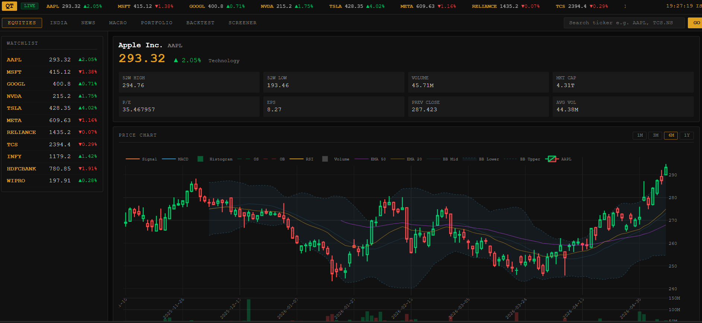
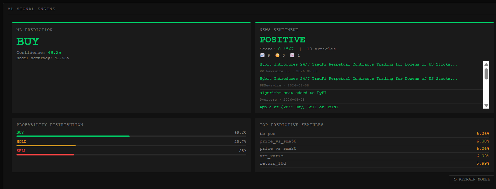
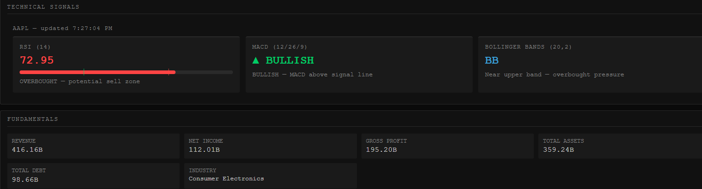
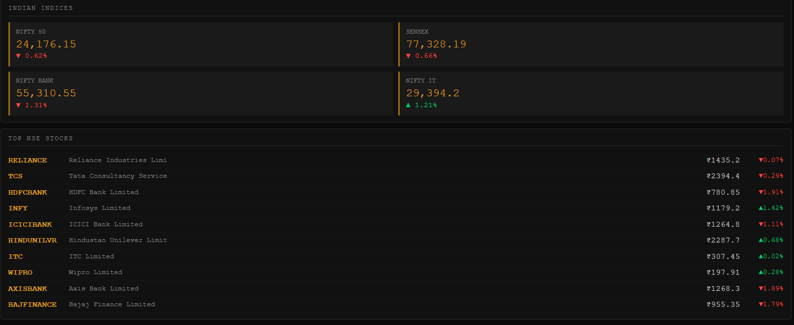
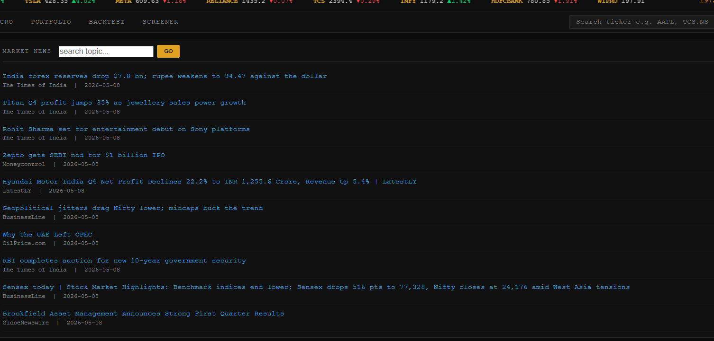

# 🖥️ Quant Terminal

> A Bloomberg Terminal-inspired, full-stack quantitative trading platform built with Python, FastAPI, and vanilla JavaScript — featuring live market data, ML-powered trading signals, technical analysis, portfolio tracking, backtesting, and macroeconomic indicators.


---

# 📸 Screenshots

## 📊 Main Equities Panel


Shows:
- Live candlestick chart
- Watchlist
- Quote cards
- Market analytics
- Multi-timeframe stock visualization

---

## 🤖 ML Signal Engine


Features:
- BUY / SELL / HOLD predictions
- Confidence scoring
- Probability distribution
- Top predictive ML features
- XGBoost-powered signal generation

---

## 📈 Technical Signals Panel


Includes:
- RSI analysis
- MACD bullish/bearish detection
- Bollinger Bands interpretation
- Technical indicator summaries

---

## 🇮🇳 India Markets Panel


Displays:
- NIFTY 50
- SENSEX
- NIFTY BANK
- NSE stock tracking
- Indian market overview

---

## 📰 News & Sentiment Panel


Features:
- Live financial news feed
- Sentiment analysis
- Positive/Negative/Neutral classification
- Market-moving headlines

---

# ✨ Features

## 📊 Live Market Data
- Real-time stock quotes for US and Indian markets (NSE/BSE)
- Live ticker tape across the top with price and % change
- Watchlist with instant click-to-load for any ticker
- Full quote card:
  - price
  - 52W high/low
  - volume
  - market cap
  - P/E
  - EPS

---

## 📈 Professional Charting
- Candlestick / OHLC charts with Plotly.js
- 4-panel stacked chart:
  - Price
  - Volume
  - RSI
  - MACD
- Bollinger Bands overlay with fill
- EMA 20, 50, 200 overlays
- Timeframe selector:
  - 1M
  - 3M
  - 6M
  - 1Y

---

## 🤖 ML Signal Engine
- XGBoost classifier trained on 5 years of historical data
- 16 engineered features:
  - momentum
  - volatility
  - trend
  - volume
- Outputs:
  - BUY
  - SELL
  - HOLD
  - confidence %
  - probability distribution
- Top predictive features displayed per ticker
- One-click model retraining
- Cached models for fast inference

---

## 📰 News Sentiment Analysis
- Live news feed from NewsAPI
- VADER sentiment scoring
- Color-coded sentiment labels
- Clickable verification links
- Sentiment aggregation across multiple articles

---

## 🇮🇳 India Markets Panel
- Live NIFTY 50, SENSEX, NIFTY BANK, NIFTY IT indices
- Top NSE stocks with live prices and % change
- One-click Indian stock analysis

---

## 💼 Portfolio Tracker
- Add custom positions
- Track:
  - shares
  - buy price
  - notes
- Live P&L calculations
- Portfolio summary statistics
- Instant position removal

---

## 📉 Backtesting Engine
Supports:

### RSI Strategy
- Buy oversold (<30)
- Sell overbought (>70)

### MACD Crossover
- Buy/sell based on MACD signal crossover

### SMA Crossover
- Golden Cross / Death Cross logic

Outputs:
- Strategy return %
- Buy & hold comparison
- Win rate
- Trade count
- Equity curve visualization
- Full trade logs

---

## 🔍 Stock Screener
Filter stocks by:
- P/E ratio
- Market cap
- Daily % change
- US + Indian markets

---

## 🌍 Macro Dashboard
Displays:
- GDP Growth
- CPI
- Unemployment Rate
- Fed Funds Rate
- Treasury Yields
- Yield Curve Spread
- VIX Fear Index
- Retail Sales

Powered by:
- FRED API

---

# 🏗️ Tech Stack

| Layer | Technology | Purpose |
|---|---|---|
| Backend | Python 3.12 + FastAPI | REST API server |
| Server | Uvicorn | ASGI server |
| Data | yfinance | Live US + India market data |
| Indicators | pandas-ta | RSI, MACD, BB, EMA |
| ML | XGBoost + scikit-learn | Trading signal classifier |
| Sentiment | VADER | News sentiment scoring |
| Charts | Plotly.js | Financial visualization |
| Frontend | HTML + CSS + JavaScript | Terminal UI |
| Cache | SQLite | API caching |
| News | NewsAPI | News feed |
| Macro | FRED API | Macroeconomic data |
| Deployment | Railway | Cloud deployment |
| Version Control | GitHub | Source control |

---

# 📁 Project Structure

```bash
quant-terminal/
├── main.py
├── config.py
├── .env
├── Procfile
├── requirements.txt
│
├── data/
│   ├── fetcher.py
│   ├── indicators.py
│   ├── news.py
│   ├── india.py
│   ├── macro.py
│   ├── portfolio.py
│   ├── screener.py
│   └── cache.py
│
├── ml/
│   ├── features.py
│   ├── model.py
│   ├── signals.py
│   ├── sentiment.py
│   ├── backtest.py
│   └── saved_models/
│
├── api/
│   ├── quotes.py
│   ├── signals.py
│   └── portfolio.py
│
├── static/
│   ├── app.js
│   ├── charts.js
│   └── style.css
│
├── screenshots/
│   ├── Daily_news.png
│   ├── Indian_stock_market.png
│   ├── Ml_modal_analysis.png
│   ├── Stock_chart.png
│   └── Technical_signals.png
│
└── templates/
    └── index.html
```

---

# ⚡ Technical Indicators Used

| Indicator | Parameters | Signal Logic |
|---|---|---|
| RSI | Length 14 | <30 = BUY zone, >70 = SELL zone |
| MACD | 12/26/9 | MACD > Signal = Bullish |
| Bollinger Bands | 20 period, 2 std | Upper/lower volatility bands |
| EMA | 20, 50, 200 | Trend direction |
| SMA | 10, 20, 50 | Backtesting crossover logic |
| ATR | Length 14 | Volatility feature |

---

# 🧠 ML Model Details

## Algorithm
XGBoost Classifier

## Training Data
5 years of OHLC market data per ticker

## Features
- Price momentum
- RSI
- MACD
- Volatility
- Trend strength
- Volume behavior
- Bollinger Band position
- ATR ratio

## Prediction Targets
- BUY → return > +0.5%
- SELL → return < -0.5%
- HOLD otherwise

## Hyperparameters

```python
n_estimators=300,
max_depth=3,
learning_rate=0.03,
subsample=0.7,
colsample_bytree=0.7,
min_child_weight=5,
gamma=0.1
```

---

# 🚀 Getting Started

## Prerequisites
- Python 3.12+
- Git

---

## Installation

```bash
# Clone repository
git clone https://github.com/AdityaSharma283/bloomberg-terminal.git

# Move into project
cd bloomberg-terminal

# Create virtual environment
python -m venv venv

# Activate virtual environment
.\venv\Scripts\Activate.ps1

# Install dependencies
pip install -r requirements.txt
```

---

## Environment Variables

Create `.env`

```env
ALPHA_VANTAGE_KEY=your_key_here
NEWS_API_KEY=your_key_here
FRED_API_KEY=your_key_here
```

Free API Sources:
- NewsAPI
- FRED
- Alpha Vantage

---

## Run Application

```bash
uvicorn main:app --reload
```

Open:

```bash
http://127.0.0.1:8000
```

---

# 📡 API Reference

| Method | Endpoint | Description |
|---|---|---|
| GET | `/api/quote/{ticker}` | Live stock quote |
| GET | `/api/history/{ticker}` | OHLC history |
| GET | `/api/indicators/{ticker}` | Technical indicators |
| GET | `/api/watchlist` | Watchlist |
| GET | `/api/financials/{ticker}` | Financial data |
| GET | `/api/signal/{ticker}` | ML signal |
| GET | `/api/sentiment/{ticker}` | News sentiment |
| GET | `/api/india/indices` | Indian indices |
| GET | `/api/india/stocks` | NSE stocks |
| GET | `/api/portfolio` | Portfolio data |
| POST | `/api/portfolio/add` | Add position |
| DELETE | `/api/portfolio/{id}` | Remove position |
| GET | `/api/screener` | Stock screener |
| GET | `/api/macro` | Macro indicators |
| GET | `/api/backtest/{ticker}` | Strategy backtest |

---

# 🗺️ Roadmap

- [ ] WebSocket live price streaming
- [ ] LSTM-based deep learning predictions
- [ ] Options chain analytics
- [ ] Push/email signal alerts
- [ ] Earnings calendar
- [ ] Sector heatmaps
- [ ] Portfolio optimization

---

# 👨‍💻 Author

## Aditya Sharma

- Computer Science Engineering Student
- Quantitative Finance + AI/ML Enthusiast
- Full-Stack Developer

### GitHub
https://github.com/AdityaSharma283

---

# 📄 License

Licensed under the MIT License.

---

# ⚠️ Disclaimer

This project is built for educational and research purposes only.

Nothing displayed in this terminal constitutes financial advice.

Always perform your own research before making investment decisions.